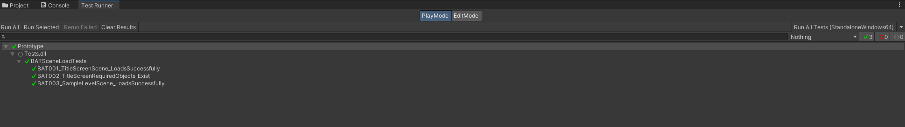
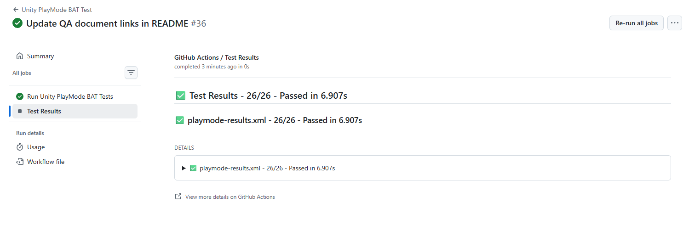
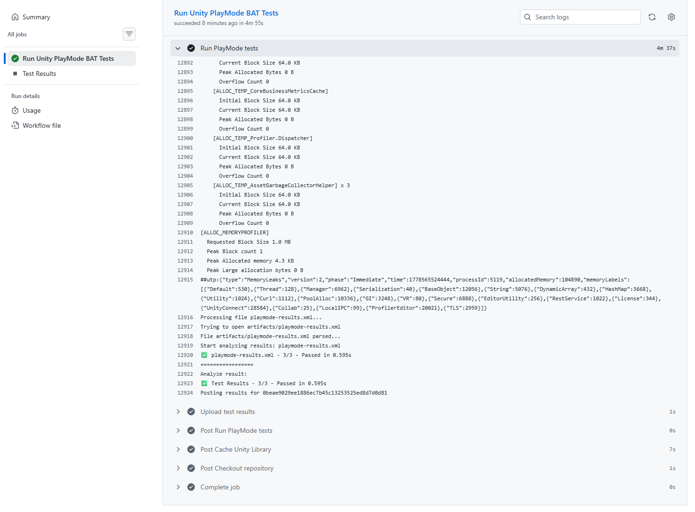
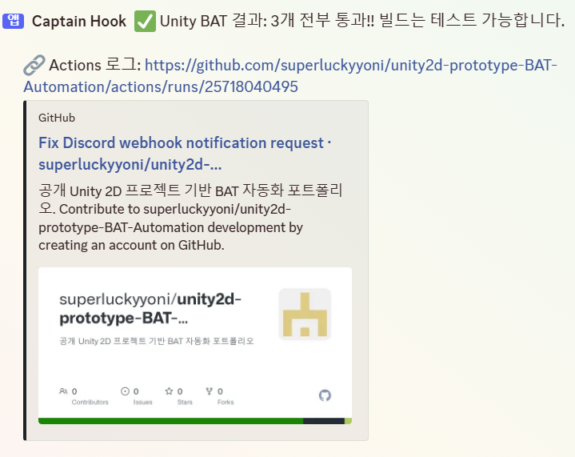
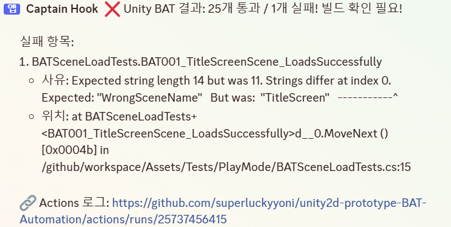

# Test Result

## 실행 환경

- Unity Version: 2022.1.10f1
- Test Type: PlayMode
- Test Framework: Unity Test Framework

## 테스트 결과

| TC ID | 테스트 항목 | 결과 |
|---|---|---|
| `BAT001` | TitleScreen 씬 로드 확인 | Pass |
| `BAT002` | TitleScreen 필수 오브젝트 확인 | Pass |
| `BAT003` | SampleLevel 씬 로드 확인 | Pass |

## 발견 및 수정한 이슈

PlayMode 테스트 실행 중 Player 빌드 단계에서 Editor 전용 API 참조로 인해 컴파일 에러가 발생했습니다.

수정 대상:
- ShadowCaster2DGenerator.cs
- Singleton.cs
- Platformer2DAutomator.cs

조치:
- UnityEditor, CustomEditor, Handles, EditorApplication 등 Editor 전용 API를 `#if UNITY_EDITOR` 조건부 컴파일로 분리했습니다.

## 결과

수정 후 로컬 Unity Test Runner에서 PlayMode BAT 테스트 3개가 정상 통과했습니다.

또한 GitHub Actions를 통해 main 브랜치에 push될 때 Unity PlayMode BAT 테스트가 자동 실행되도록 구성했으며,  
CI 환경에서도 BAT 테스트 3개가 모두 정상 통과했습니다.

- Local Result: 3/3 Passed
- CI Result: 3/3 Passed
- Workflow: Unity PlayMode BAT Test

## 실행 결과 스크린샷

### Unity Test Runner

### GitHub Actions Test Results

### GitHub Actions Workflow Log

## Discord 알림 검증

GitHub Actions 테스트 완료 후 Discord Webhook을 통해 성공/실패 결과가 자동 전송되도록 구성했습니다.

성공 시에는 전체 BAT 통과 결과와 Actions 로그 링크를 전송하며,  
실패 시에는 실패한 테스트명, 실패 사유, 코드 위치, Actions 로그 링크를 함께 전송하도록 구성했습니다.

### Discord 성공 알림

### Discord 실패 알림

